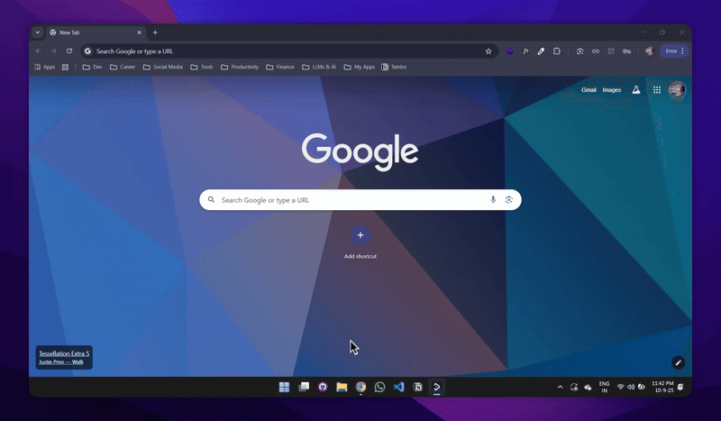

# A Natural Language Interface for Making your Portfolio (Cursor for Portfolio)

Talk to your resume like you would to a friend: "I have prior experience at Google" or "I'm a Full Stack Developer". The AI understands context and searches the Schema. It can update and manage your portfolio as you go.

## Demo
https://tambohack.vercel.app/demo.mp4

## Live Demo (try it out!)

[](https://tambohack.vercel.app/demo.mp4)

## How It Works

This app demonstrates the power of **Tambo AI** for building conversational interfaces with dynamic UI generation.

## Tech Stack

- **Next.js 15** - React framework with App Router
- **Tambo AI SDK** - Conversational AI with dynamic UI generation
- **Magic UI** - For Design Engineering Components
- **Tailwind CSS** - Styling and responsive design
- **TypeScript** - Type-safe development
- **Zod** - Runtime schema validation

## Run Locally

```bash
git clone https://github.com/fudailzafar/chatportfolio.git
cd tambo-hack
npm install --force
npx tambo init
npm run dev
```
